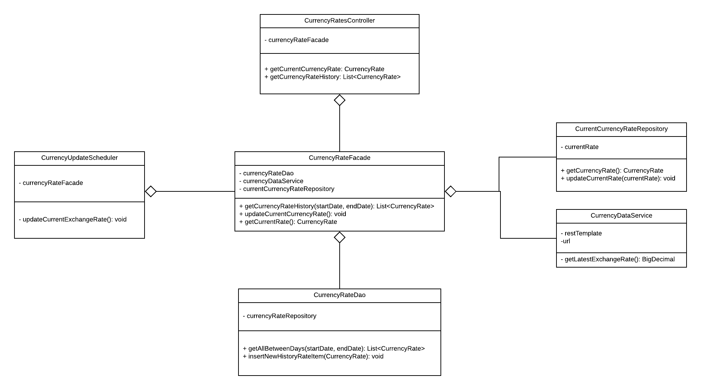

An Appllication for having the latest exchange rate and historical logs
of EUR-USD 

used techs are:
<ul>
    <li><b>Java 8</b> as PL</li>
    <li><b>Spring Boot</b> as Rest Framework</li>
    <li><b>H2</b> as Db</li>
    <li><b>JPA</b> as ORM tool</li>
    <li><b>Swagger</b> as API visualizer</li>
    <li><b>Mockito and JUnit</b> for testing</li>
    <li><b>Lucid Chart</b> for design illustration</li>
</ul>
 
 Swagger link: <a href="http://localhost:8080/swagger-ui.htm">http://localhost:8080/swagger-ui.htm</a>
 
 the design is like this:
 
 